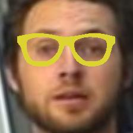

# Dodge Image Generator

    

## Preprocess
Before generating the attack images, the input should be processed by `face_landmark_detection.py`.
Args:
1. input folder
2. wildcard (ex. if there's a file structure)

This will generate the images that can run through MatConvNet.

The next step is to run `align_vgg_pose` which can be run from `generate.m` if `digital_dodging` or equivalent is replaced by a call to that function passing in the input path, wildcard and output path.

## Running
After runnning the preprocess, `generate.m` will create the attack images (for now, digital dodging as the only mode).

## Limitations
A GTX2070 card was used which has 8 GB of VRAM, but MatConvNet threw `out of memory` errors on some images (all were 224x224).
Either better hardware or scaled down images should fix this issue.

## Dependencies
[Accessorize-to-a-crime](https://github.com/mahmoods01/accessorize-to-a-crime) has all necessary dependencies and is the backbone of this little tool
